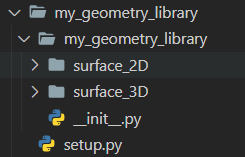
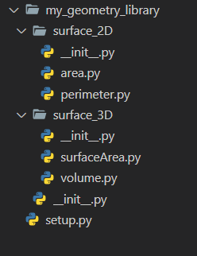

#

Let us create a library : my_geometry_library

_Step 1_ : Create Directory 'my_geometry_library' and 'setup.py'

_Step 2_ : 'my_geometry_library' will contain all the modules and '**init**.py' file. ( Remember each folder/module in this folder will contain '**init**.py' file).

#

#

We have created 2 modules and one **init** file in my_geometry_library.

#

<h1>Important Points</h1>
<ul>
<li>Use """ """ to write comment in each __init__ file for module and in functions / classes for 'help()' function in python</li>
<li>import all the modules or file in the __init__ file which are sibling to it , to call functions like surface_2D.area.rectangle()</li>
<li>write version of library in its main __init__ file using __version__ = 0.1</li>
<li>write setup file properly</li>
</ul>

<h1>Installation</h1>
Go to location of library directory where setup file is and enter command : 'pip install .' and USe it

<h1>Publish the File</h1>

<ul>
  <li>Go to location of library directory where setup file is and enter command : 'python setup.py bdist_wheel' </li>
  <li> upload the The file with name "---.whl" file in dist directory using pypi.
  <ul>
    <li> Use 'pip install twine' to install twine which helps you to upload your project in Pypi</li>
    <li>Go to main library folder and use 'twine upload dist/*' . To upload everything of dist folder in pypi</li>
  </ul>
  </li>
</ul>

